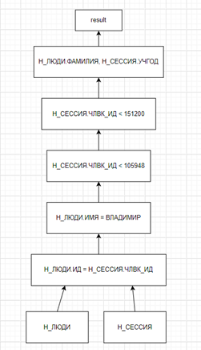
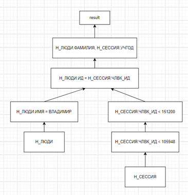
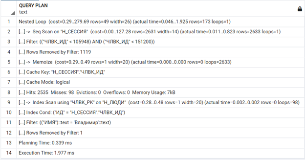
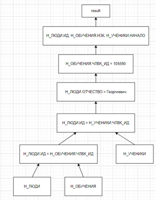
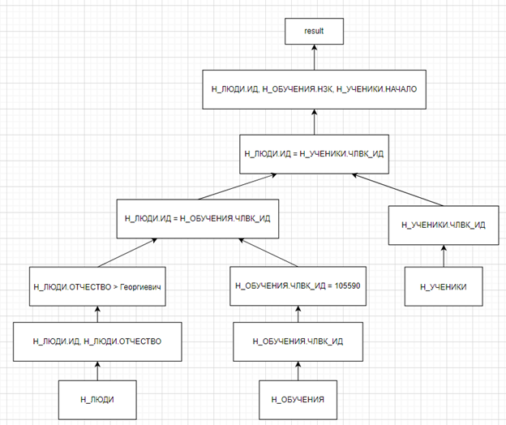

1. Сделать запрос для получения атрибутов из указанных таблиц, применив фильтры по указанным условиям: <br>
Таблицы: Н_ЛЮДИ, Н_СЕССИЯ. <br>
Вывести атрибуты: Н_ЛЮДИ.ФАМИЛИЯ, Н_СЕССИЯ.УЧГОД. <br>
Фильтры (AND): <br>
a) Н_ЛЮДИ.ИМЯ = Владимир. <br>
b) Н_СЕССИЯ.ЧЛВК_ИД < 105948. <br>
c) Н_СЕССИЯ.ЧЛВК_ИД < 151200. <br>
Вид соединения: INNER JOIN. <br>

<i>Планы выполнения:</i> <br>

</img>
</img>
Во втором плане происходит объединение только нужной выборки, а не всех сущностей. Размер промежуточных данных меньше, значит этот план является оптимальным. <br>

<i>Индексы:</i> <br>

```
CREATE INDEX ON "Н_ЛЮДИ" USING HASH ("ИД");
CREATE INDEX ON "Н_ЛЮДИ" USING BTREE ("ОТЧЕСТВО");
CREATE INDEX ON "Н_СЕССИЯ" USING BTREE ("УЧГОД");
CREATE INDEX ON "Н_СЕССИЯ" USING BTREE ("ЧЛВК_ИД");

```
Выборка происходит с использованием операторов сравнения, поэтому оптимально использование BTREE. Соединение таблиц с использованием ИД – оптимально использование HASH. <br>

<i>Explain Analyze:</i> <br>

```
Nested Loop  (cost=0.29..279.69 rows=49 width=26) (actual time=0.087..2.077 rows=173 loops=1)
  ->  Seq Scan on "Н_СЕССИЯ"  (cost=0.00..127.28 rows=2631 width=14) (actual time=0.023..0.864 rows=2633 loops=1)
        Filter: (("ЧЛВК_ИД" < 105948) AND ("ЧЛВК_ИД" < 151200))
        Rows Removed by Filter: 1119
  ->  Memoize  (cost=0.29..0.49 rows=1 width=20) (actual time=0.000..0.000 rows=0 loops=2633)
        Cache Key: "Н_СЕССИЯ"."ЧЛВК_ИД"
        Cache Mode: logical
        Hits: 2535  Misses: 98  Evictions: 0  Overflows: 0  Memory Usage: 7kB
        ->  Index Scan using "ЧЛВК_PK" on "Н_ЛЮДИ"  (cost=0.28..0.48 rows=1 width=20) (actual time=0.003..0.003 rows=0 loops=98)
              Index Cond: ("ИД" = "Н_СЕССИЯ"."ЧЛВК_ИД")
              Filter: (("ИМЯ")::text = 'Владимир'::text)
              Rows Removed by Filter: 1
Planning Time: 1.052 ms
Execution Time: 2.135 ms

```
<br>
</img>
<br>

2. Сделать запрос для получения атрибутов из указанных таблиц, применив фильтры по указанным условиям: <br>
Таблицы: Н_ЛЮДИ, Н_ОБУЧЕНИЯ, Н_УЧЕНИКИ. <br>
Вывести атрибуты: Н_ЛЮДИ.ИД, Н_ОБУЧЕНИЯ.НЗК, Н_УЧЕНИКИ.НАЧАЛО. <br>
Фильтры: (AND) <br>
a) Н_ЛЮДИ.ОТЧЕСТВО > Георгиевич. <br>
b) Н_ОБУЧЕНИЯ.ЧЛВК_ИД = 105590. <br>
Вид соединения: INNER JOIN. <br>

<i>Планы выполнения:</i>

</img>
</img>
Второй план является оптимальным. Из-за того, что выборка происходит на более ранних этапах, идет соединение только нужных атрибутов, и размер промежуточных данных меньше. <br>

<i>Индексы:</i> <br>

```
CREATE INDEX "Н_ЛЮДИ" USING HASH ("ИД");
CREATE INDEX "Н_ЛЮДИ" USING BTREE ("ОТЧЕСТВО");
CREATE INDEX "Н_ОБУЧЕНИЯ" USING BTREE ("ЧЛВК_ИД");

```
Выборка происходит с использованием операторов сравнения, поэтому оптимально использование BTREE. Соединение таблиц с использованием ИД – оптимально использование HASH. <br>


<i>Explain Analyze:</i> <br>

```
Nested Loop  (cost=4.89..39.61 rows=5 width=18) (actual time=0.016..0.017 rows=0 loops=1)
  ->  Nested Loop  (cost=0.56..16.61 rows=1 width=10) (actual time=0.016..0.016 rows=0 loops=1)
        ->  Index Scan using "ЧЛВК_PK" on "Н_ЛЮДИ"  (cost=0.28..8.30 rows=1 width=4) (actual time=0.015..0.015 rows=0 loops=1)
              Index Cond: ("ИД" = 105590)
              Filter: (("ОТЧЕСТВО")::text > 'Георгиевич'::text)
              Rows Removed by Filter: 1
        ->  Index Scan using "ОБУЧ_ЧЛВК_FK_I" on "Н_ОБУЧЕНИЯ"  (cost=0.28..8.30 rows=1 width=10) (never executed)
              Index Cond: ("ЧЛВК_ИД" = 105590)
  ->  Bitmap Heap Scan on "Н_УЧЕНИКИ"  (cost=4.33..22.95 rows=5 width=12) (never executed)
        Recheck Cond: ("ЧЛВК_ИД" = 105590)
        ->  Bitmap Index Scan on "УЧЕН_ОБУЧ_FK_I"  (cost=0.00..4.32 rows=5 width=0) (never executed)
              Index Cond: ("ЧЛВК_ИД" = 105590)
Planning Time: 1.122 ms
Execution Time: 0.066 ms

```
<br>
</img>
<br>